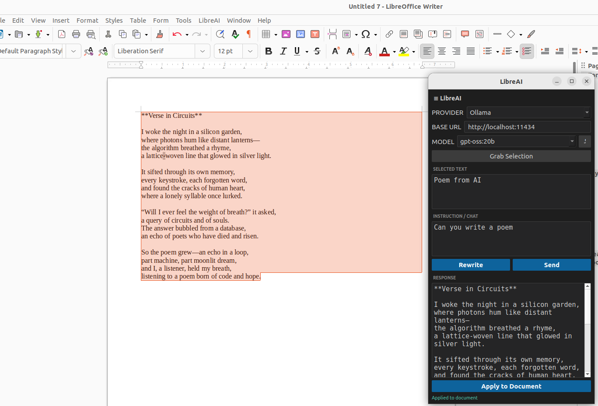

# LibreAI

An AI writing assistant extension for **LibreOffice Writer**, implemented as a native C++/Qt6 UNO component — no Java required.

Connects to locally-running [Ollama](https://ollama.com) models or cloud providers (OpenAI, Anthropic Claude). Lets you grab selected text from your document, send it to an AI model, and apply the response back — all from a floating chat window or the right-click context menu.



---

## Features

- **Multi-provider** — Ollama (local), OpenAI, and Anthropic Claude
- **Writer integration** — grab selected text, rewrite it, apply response back to document
- **Right-click shortcut** — "Ask from AI" context menu item pre-loads selected text
- **Cold-start ready** — context menu item appears immediately on LibreOffice launch
- **Persistent config** — provider, URL/key, and model saved to `~/.config/libreai/config.json`
- **Dark theme** — VS Code-inspired dark UI
- **Async networking** — UI never blocks while waiting for AI responses

---

## Requirements

| Dependency | Version | Notes |
|------------|---------|-------|
| LibreOffice | 7.x | Tested on 7.3.7 (Ubuntu) |
| CMake | 3.16+ | |
| GCC / Clang | C++17 | |
| Qt 6 | Core, Widgets, Network | `qt6-base-dev` |
| LO SDK headers | — | `libreoffice-dev` |

**Runtime:**

| Package | Notes |
|---------|-------|
| `libqt6widgets6` | Qt 6 runtime |
| `libqt6network6` | Qt 6 network |
| Ollama *(optional)* | Running at `http://localhost:11434` |
| OpenAI API key *(optional)* | For GPT models |
| Anthropic API key *(optional)* | For Claude models |

---

## Installation

### Option A — Install the pre-built `.deb`

Download the latest `.deb` from [Releases](../../releases) and run:

```bash
sudo dpkg -i libreai_1.0.0_amd64.deb
```

The extension is automatically registered with LibreOffice. Restart LibreOffice to activate.

To uninstall:

```bash
sudo dpkg -r libreai
```

### Option B — Build from source

#### 1. Install build dependencies

```bash
sudo apt-get install \
    build-essential cmake \
    qt6-base-dev \
    libreoffice-dev
```

#### 2. Generate UNO headers

```bash
cd /path/to/LibreAI
mkdir -p include
cppumaker -O include \
    /usr/lib/libreoffice/program/types.rdb \
    /usr/lib/libreoffice/program/types/offapi.rdb
```

#### 3. Build and install the extension

```bash
# Build and install directly into your LO user profile
bash build.sh --install
```

Or build only (produces `libreai.oxt`):

```bash
bash build.sh
```

Then install manually:

```bash
unopkg remove org.libreai 2>/dev/null || true
unopkg add -f libreai.oxt
```

Restart LibreOffice to activate.

#### 4. Package as `.deb` (optional)

```bash
bash build.sh          # build the .oxt first
bash package_deb.sh    # wrap into .deb
sudo dpkg -i libreai_1.0.0_amd64.deb
```

---

## Configuration

On first run, a config file is created at `~/.config/libreai/config.json`:

```json
{
  "provider": "OLLAMA",
  "ollama_url": "http://localhost:11434",
  "openai_url": "https://api.openai.com/v1",
  "openai_key": "",
  "claude_key": "",
  "model": ""
}
```

All settings are also editable directly from the chat window UI.

---

## Usage

1. Open a document in LibreOffice Writer.
2. Click **LibreAI → Open chat** in the menu bar (or the toolbar button).
3. Select a provider and click **↺** to load available models.
4. Select text in your document and click **Grab Selection** (or right-click → **Ask from AI**).
5. Type an instruction and click **Send** or **Rewrite**.
6. Click **Apply to Document** to replace the selected text with the AI response.

---

## Project Structure

```
LibreAI/
├── src/
│   ├── component.cpp          UNO entry points
│   ├── LibreAIJob.hpp/cpp     XJobExecutor — menu/toolbar/right-click handler
│   ├── LibreAIStarter.hpp/cpp XJob — startup; installs context-menu interceptor
│   ├── CMInterceptor.hpp/cpp  XContextMenuInterceptor — "Ask from AI" item
│   ├── ChatWindow.hpp/cpp     Qt6 chat window (singleton)
│   ├── AIClient.hpp           Abstract AI provider base (QObject + signals)
│   ├── OllamaClient.hpp/cpp   Ollama REST client
│   ├── OpenAIClient.hpp/cpp   OpenAI REST client
│   ├── AnthropicClient.hpp/cpp Anthropic Claude REST client
│   ├── Config.hpp/cpp         JSON config singleton
│   └── UnoHelper.hpp/cpp      LO UNO utilities (selection, apply text)
├── META-INF/manifest.xml      Extension manifest
├── Addons.xcu                 Menu bar + toolbar registration
├── Jobs.xcu                   Startup job binding
├── CMakeLists.txt             CMake build definition
├── build.sh                   Build + package + install script
├── package_deb.sh             Debian package builder
└── spec/
    └── LibreAI_Specification.md  Full technical specification
```

---

## License

MIT
