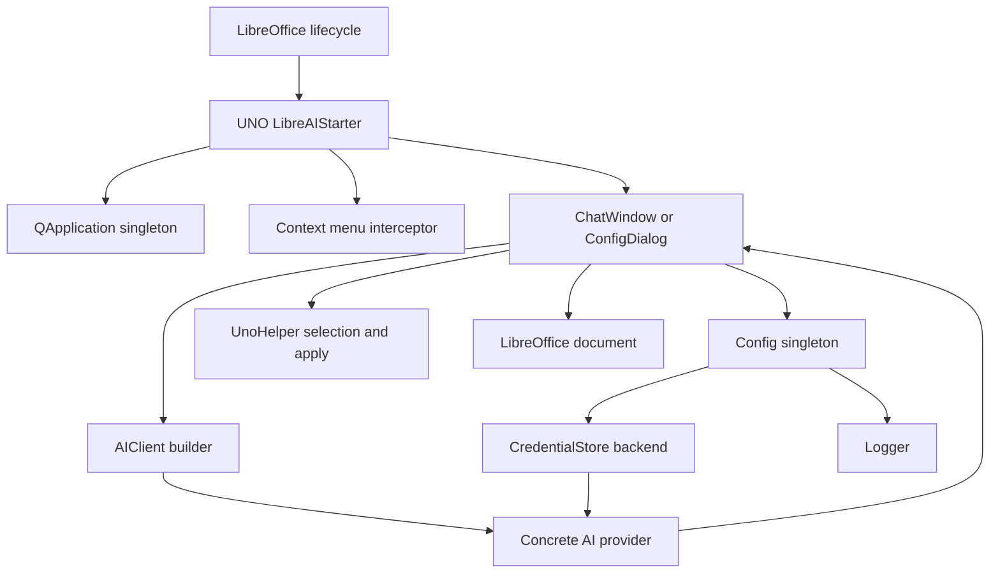

# LibreAI Architecture Overview

## Runtime Composition

- LibreOffice lifecycle triggers UNO services [`org.libreai.starter`](spec/architecture.md:19) and [`org.libreai.job`](spec/architecture.md:18).
- [`LibreAIStarter::execute`](src/uno/LibreAIStarter.cpp:80) creates the singleton `QApplication`, applies localisation via [`Config::applyLanguage`](spec/architecture.md:52), installs the context-menu interceptor [`CMInterceptor`](spec/uno-components.md:46), and decides whether to surface [`ChatWindow::instance`](spec/ui-chat-window.md:6) or [`ConfigDialog::instance`](spec/architecture.md:23) by checking [`Config::isConfigured`](spec/config.md:95).
- Document utilities in [`UnoHelper`](spec/uno-components.md:70) expose `getSelectedText`, `applyText`, and `applyRichText`, bridging Qt widgets back into Writer, Impress, or Calc when the user applies model output.

## Core Services

- [`Config`](spec/config.md:3) persists provider preferences and UI options, while deferring API key storage to [`CredentialStore`](spec/architecture.md:24).
- [`CredentialStore::backend`](spec/architecture.md:90) selects an OS-specific secure store (Qt6Keychain, Security.framework, DPAPI, or in-memory fallback) at compile time using the `HAVE_*` flags.
- [`Logger`](README.md:257) installs a Qt message handler to capture diagnostics at the configured log level into `~/.config/libreai/libreai.log`.

## AI Provider Abstraction

- [`AIClient`](spec/ai-providers.md:3) defines the async signal-based contract `modelsReady`, `responseReady`, and `errorOccurred` for all providers.
- Concrete clients such as [`OllamaClient`](spec/ai-providers.md:44) and [`OpenAIClient`](spec/ai-providers.md:73) adapt to REST dialect differences yet emit the common signals consumed by the UI.
- The provider factory inside [`ChatWindow::buildClient`](spec/ui-chat-window.md:3) instantiates the appropriate client on demand, enabling future additions through the documented process [`Adding a New Provider`](spec/ai-providers.md:161).

## UI Layer Responsibilities

- [`ChatWindow`](spec/ui-chat-window.md:1) renders Markdown responses, manages conversation history, and optionally writes formatted output back into Writer through [`UnoHelper::applyRichText`](spec/ui-chat-window.md:48).
- [`ConfigDialog`](spec/architecture.md:23) exposes provider-specific configuration panes and triggers `resetInstance` on the UI singletons when the language changes.

## Data Flow Diagram

## Execution Constraints

- Qt windows always use `Qt::Window` to avoid blocking the UNO thread [`Qt Inside LibreOffice — Constraints`](spec/architecture.md:100).
- Networking relies on `QNetworkAccessManager` for non-blocking I/O, aligning with UNO watchdog expectations.
- `QApplication` lifetime spans the entire LibreOffice session; it is never destroyed once created [`Qt Inside LibreOffice — Constraints`](spec/architecture.md:102).

